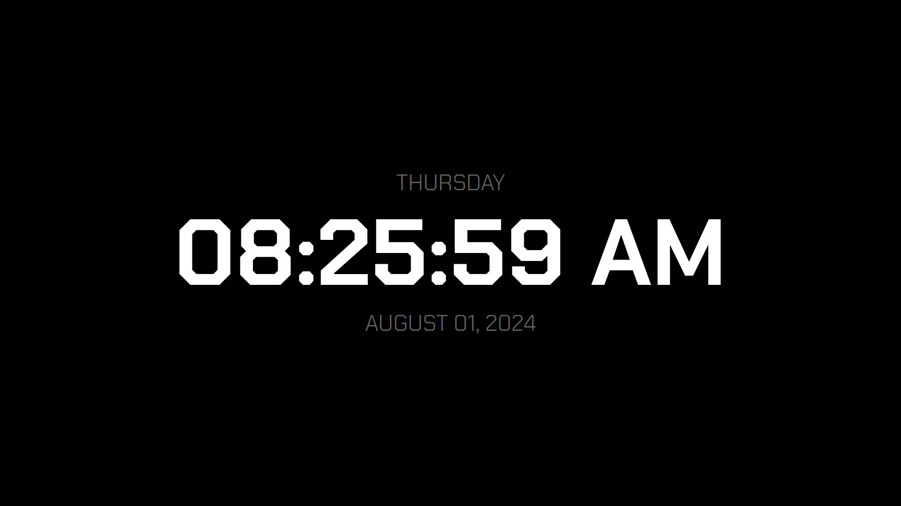

# DesktopClock

Simple desktop clock application written in pure Win32 C++. The original version I wrote of this app used Flutter
and it's **~45MB** so I wanted something much lighter weight. This comes in at around **300KB* with the debug build
so quite an improvement.

